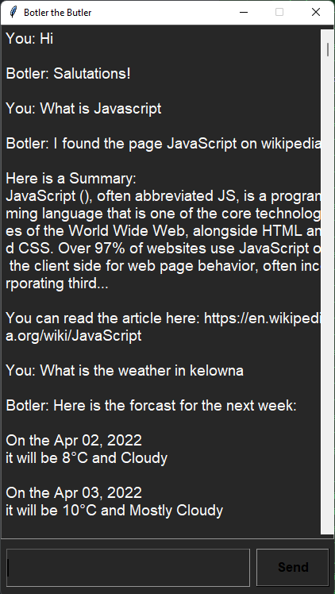

# M.A.A.M.Y's Chat Bot (Individual Project)
Software Engineering Term 2, 2022

Our group has decide to create a chatbot using python. We have used the <a href="https://www.nltk.org/" target="_blank">***NLTK***</a> python Library in order to create our chatbot. The bot will be taking the role of a sassy, well educated, butler with a good scence of humour, meanwhile the user will take the role of its master.

In A3 we have made significant in terms of user experience with new GUI and also technical improvements in the conversation flow with help of sentiment analysis and autocorrect for spelling mistakes, which was not possible in our previous A2 version of the bot.

As we promised in the A2 version, "Future revisions and additions could improve versatility", we have delivered on that promise.

You can find a list of the features and improvements in A3 [here](#a3-features-and-improvements).

The MIT liscence is in this same direcory and is named <a href="https://github.com/Software-Engineering-Group-4-Maamy/chat-bot/blob/main/LICENSE" target="_blank">LICENSE</a>.

## Instalation guide
1. First, install <a href="https://pip.pypa.io/en/stable/installation/">pip</a> if you have not already
2. Run `pip install --user -U nltk`
3. Then, clone this git reposotory, or download the zip file. 
4. Inside the python directory, run the main.py file `python main.py`
5. Vouala - you now own a human soul.

## Sample output

		B:Hi, I'm Botler want to have a conversation with you!
		B:Please speak to me in lowercase English. Type quit if you wish to end this conversation. 
		U:hello
		B:Greetings!
		U:my name is Matthew
		B:Hello matthew, How are you feeling today?
		U:I am a bit concerned about this recent stock market fiasco
		B:Do not be alarmed sir, I've handled your investments accordingly
		U:sorry for ever doubting you
		B:You needn't worry at all
		U:can you find the next best stock for me
		B:I am unable to search for the next best stock, for now.
		U:sorry for expecting so much
		B:You needn't worry at all
		U:have you seen my underwear?
		B:I believe you left it under your bed again sir
		U:I like underwear  
		B:Exquisite taste sir
		U:i am not a sir
		B:Apologies, but sir it is the best I can do.
		U:you're being difficult
		B:You literally programed me, I can only say what you allowed me to say
		U: What is the weather in Kelowna Bolter?
		B: Here is the forcast for the next week:
			On the Apr 02, 2022
			it will be 8°C and Cloudy

			On the Apr 03, 2022
			it will be 10°C and Mostly Cloudy

			On the Apr 04, 2022
			it will be 7°C and Partly Sunny

			On the Apr 05, 2022
			it will be 2°C and Mostly Cloudy

			On the Apr 06, 2022
			it will be 6°C and Cloudy
		U: What is JavaScript
		B:I found the page JavaScript on wikipedia

			Here is a Summary:
			JavaScript (), often abbreviated JS, is a programming language 
			that is one of the core technologies of the World Wide Web, 
			alongside HTML and CSS. Over 97% of websites use JavaScript on 
			the client side for web page behavior, often incorporating third...

			You can read the article here: https://en.wikipedia.org/wiki/JavaScript
		U:quit
		B:Thank you for chatting with me
	
## Data Flow Diagrams

### Level 0:


### Level 1:


### Improved A3: GUI Conversation Flow



As you can see, the bot can now access wikipedia and the weather channel.
### Errors in output
        U:what's your favotite movie
        B:Sorry sir, I didn't understand
Botler responds this way because Botler cannot recognize a phraze that is not exactly the same as what it uses as examples.

## Features

1. Case Handling: Botler now handles all types of cases lower, upper and mixed case.

        
        U: MY NaMe IS YasH
        Botler: Hello, how are you feeling today?
        

2. Sentiment Analysis: Botler now uses the <a href="https://www.nltk.org/api/nltk.sentiment.html" target="_blank">nltk.sentiment</a> to determine the sentiment of the user's input.

        U: THAT WAS MEAN
        B: I am doing my best to be polite, you are just making it difficult

3. Autocorrect: Botler now uses the ```Speller``` class from  <a href=https://github.com/filyp/autocorrect target="_blank">autocorrect</a> to correct the spelling of the user's input.
        
        U: Hellooo
        B: Salutations!

4. Unit Testing: Added unit tests for ```chatbot.py``` and ```app.py``` in the ```test_chatbot.py``` and ```test_app.py``` files respectively. These test whether the classes have been initialized correctly and whether the methods are working as expected.
More details about unit testing can be found [here](#unit-testing).

5. Phrasal: Botler now handles all types of input regardless of the exact wording of the statement.

        
        U: Sorry BolTer I didnt know
        Botler: You needn't worry at all

6. Further Prospective API abilities
 
	1) Autocorrect Function: The Botler could be utilized as a polite bot for implementing autocorrect.	
	2) Speech analysis: Understanding Speech patterns when learning a new language can be difficult. This process can be made easier by using Botlers synonym recognizer, allowing the identification of similar sentiments even when a different word is used. 
	3) Sentiment Analysis: Botler has an advanced understanding of the English lexicon and can help a user understand the tone of one’s email. 
	4) Continuous Chat: Botlers ability to handle long drawn out conversations can be utilized to handle email conversations you just really don’t want to have.
	5) Unique Dialogue Library: Botler can handle all your automated messages through use of its language library. This could be implanted as an API so that an email gets forwarded to it and the library would allow Botler to select the correct, and polite, reply. 

### New Features since A3

7. Weather API: Bolter now uses ```Python_weather``` and ```geonamescache``` to find and give the user the forcast for the week ahead.  Using the tokenization from A3 Bolter searches for the keyword weather and if it exists imediately calls the ```weather_api``` function which finds the location the user was looking for, checks if the city exists and then provides the weather report for the following week in that location.

		U: What is the weather in Kelowna Bolter?
		B: Here is the forcast for the next week:
		On the Apr 02, 2022
		it will be 8°C and Cloudy

		On the Apr 03, 2022
		it will be 10°C and Mostly Cloudy

		On the Apr 04, 2022
		it will be 7°C and Partly Sunny

		On the Apr 05, 2022
		it will be 2°C and Mostly Cloudy

		On the Apr 06, 2022
		it will be 6°C and Cloudy

8. Wikipedia API: Bolter can now access Wikipedia to answer users questions if it does not understand what they were saying immediately.  If the user uses one of the five key words What, why, who, where, how, the program will call the ```wikipedia_api``` function.  In this function it will concatinate the remaining key words and then search wikipedia to see if there is an article with that title.  If there is one the bot will return the title, summary and the url for more reading.

		U: What is JavaScript
		B:I found the page JavaScript on wikipedia

		Here is a Summary:
		JavaScript (), often abbreviated JS, is a programming language 
		that is one of the core technologies of the World Wide Web, 
		alongside HTML and CSS. Over 97% of websites use JavaScript on 
		the client side for web page behavior, often incorporating third...

		You can read the article here: https://en.wikipedia.org/wiki/JavaScript


## Class Organization

1. ***Botler:***
The Botler class is in charge of creating and maintaining all aspects of the chat object imported from the NLTK.

The Botler class has three members within it. `def __init__(self)`, `def converse(self)` and `def generate_response(self, msg)`. 

`__init__(self)` member acts as the Constructor for the Botler object. It creates the chat object as well.

`converse(self)` is now deprecated. But it used to start the conversation with a custom message. It also includes all of the error handling and logic required for the main conversation to take place with the chat bot.
to start a conversation, write this line of code: `ch.Botler().converse()`

`generate_response(self, msg)` generates a response for a specific message inputted by the user. 

2. ***ChatApplication:***
The ChatApplication class is in charge of creating and managing the application. That is it creates the corresponding GUI elements and then manages them. This class was adapted from the MIT licensed project titled <a href=https://github.com/python-engineer/python-fun>***Python Fun***</a> Under `python-fun/chatbot-gui/app.py`. 

This class has `_insert_message(self, msg, sender), _on_enter_pressed(self, event), run(self), _init_window(self), __init__(self)`

`_insert_message(self, msg, sender)` inserts a message to the GUI given a message and the name of the sender.

`_on_enter_pressed(self, event)` calls `_insert_message(self, msg, sender)` with the user's message and generates a response from the chatbot.

`run(self)` initiates the program by creating the window and starting the chatbot. It is the only public member of the class.

`_init_window(self)` creates the GUI and initializes all settings.

`__init__(self)` calls `_init_window(self)`, and initialises `Botler` in order to run the app.

### Unit Testing

The unit tests have been written with the help of the [unittest](https://docs.python.org/3/library/unittest.html) module, which is a unit testing framework inspired by JUnit of Java.

1. Unit Tests for ```app.py```

- ```def test_app_instances(self):```
        This tests whether the class has been initialized correctly. Checks all the various types of instances required to run the application and ensures that they are all initialized correctly.
- ```def test_app_title(self):```
        Tests whether the title of the window is correct.
- ```def test_app_insert_message(self):```
        Tests whether the message is inserted correctly in the GUI and passed to Botler.

2. Unit Tests for ```chatbot.py```

- ```def test_generate_token(self):```
        Tests whether the return type is a string so that it can be processed and understood by Botler.
        This is was required to test because tokenization splits a string into a list of words.
- ```def test_Botler_init_attributes(self):```
        Tests whether the Botler class has been initialized correctly by checking the instances of the various attributes it contains
- ```def test_Botler(self):```
        Tests whether the response generated by Botler is a string
	
## A3: Git Commit Graph


